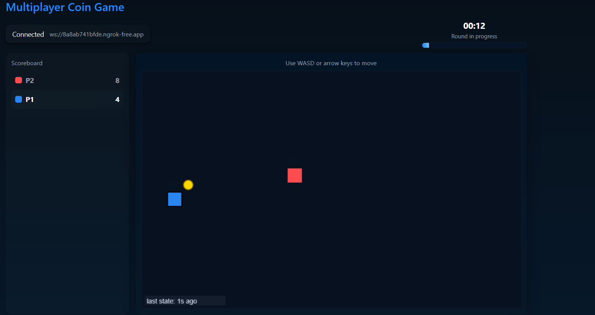

# Coin Collector - Assignment (Python server + HTML client)

## Overview
This is a minimal submission that satisfies:
- Authoritative server (Python `server.py`) tracking positions, coins, scoring.
- Two browser clients (`client.html`) connecting via WebSocket.
- 200ms artificial latency simulated on both directions.
- Client interpolation to smooth remote player motion.

## Requirements
- Python 3.8+
- `websockets` Python package
- A browser (Chrome/Edge)
- Optional: `python -m http.server` to serve client files

## Run locally
1. Create & activate virtual env (optional):
   ```bash
   python -m venv venv
   source venv/bin/activate   # or venv\Scripts\activate on Windows
   pip install websockets
## 🖼 Game Screenshot


## 🎥 Demo Video
https://drive.google.com/file/d/1Rr736Lk9NQjuzL3JP1naCmpk6BSbQ9pf/view?usp=sharing

